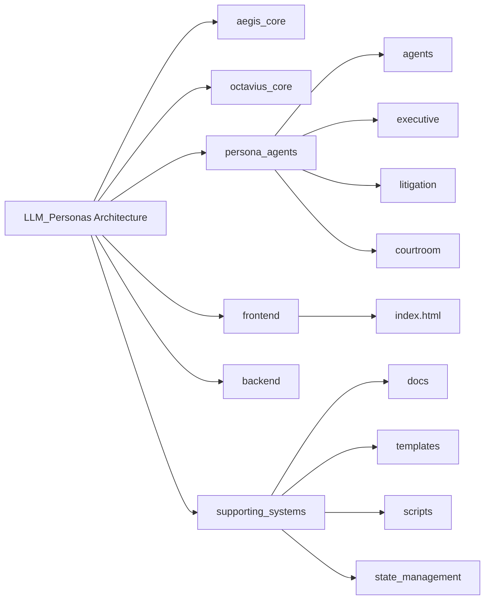

```mermaid
  graph LR
    A[LLM_Personas Architecture] --> B[aegis_core]
    A --> C[octavius_core]
    A --> D[persona_agents]
    D --> E[agents]
    D --> F[executive]
    D --> G[litigation]
    D --> H[courtroom]
    A --> I[frontend]
    I --> J[index.html]
    A --> K[backend]
    A --> L[supporting_systems]
    L --> M[docs]
    L --> N[templates]
    L --> O[scripts]
    L --> P[state_management]
```